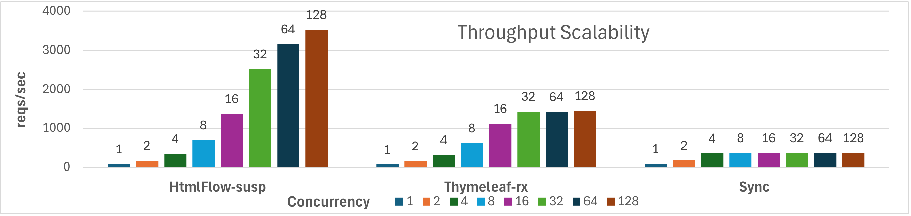

# Comparing Template engines for Spring WebFlux

This is a demo project, based on former [_Comparing Template engines for Spring Web MVC_](https://github.com/jreijn/spring-comparing-template-engines),
which accompanied [Jeroen Reijn](https://github.com/jreijn) in
["Shoot-out! Template engines for the JVM"](http://www.slideshare.net/jreijn/comparing-templateenginesjvm)
presentation, which shows the differences among several Java template engines in combination with Spring MVC,
now with **Spring WebFlux**.
Some template engines were removed from former benchmark, since they do not support
PSSR (_Progressive server-side rendering)_.

Template engines used in this project are:

* [Thymeleaf](http://www.thymeleaf.org/) - 3.2.2
* [HtmlFlow](https://github.com/xmlet/HtmlFlow/) - 4.6
* [kotlinx.html](https://github.com/Kotlin/kotlinx.html) - 0.11.0
* [Rocker](https://github.com/fizzed/rocker) - 1.4.0
* [JStachio](https://github.com/jstachio/jstachio) - 1.3.4
* [Pebble](https://pebbletemplates.io/) - 3.2.2
* [Freemarker](https://freemarker.apache.org/index.html) - 2.3.32
* [Trimou](https://github.com/trimou/trimou) - 2.5.1.Final
* [Velocity](https://velocity.apache.org/) - 2.3

A key difference from the previous benchmark is the use of a reactive data model,
specifically `Observable<Presentation>` from the RxJava library, instead of a `List<Presentation>`.
However, **not all template engines** can handle reactive data models **without blocking**.
**Only Thymeleaf and HtmlFlow effectively manage asynchronous APIs.**
For the other template engines, we must block when accessing data from `Observable<Presentation>`,
but this blocking should occur in a new coroutine, freeing the request handler coroutine to
process other HTTP requests.
Routes **blocking** are marked with `/sync` in their path to highlight this behavior.
Next, we present the list of routes handled by each templating approach:
* http://localhost:8080/thymeleaf - asynchronous using `ReactiveDataDriverContextVariable` 
* http://localhost:8080/thymeleaf/sync - blocking
* http://localhost:8080/htmlFlow - asynchronous, using a callback to resume execution. 
* http://localhost:8080/htmlFlow/suspending - asynchronous, using Kotlin suspending functions.
* http://localhost:8080/htmlFlow/sync - blocking
* http://localhost:8080/kotlinx/sync - blocking
* http://localhost:8080/rocker/sync - blocking
* http://localhost:8080/jstachio/sync - blocking
* http://localhost:8080/pebble/sync - blocking
* http://localhost:8080/freemarker/sync - blocking
* http://localhost:8080/trimou/sync - blocking
* http://localhost:8080/velocity/sync - blocking

You need Java 17 and Maven 3 to build and run this project.

Build the project with: `mvn clean install` 

Run the project with: `mvn spring-boot:run`

## Build and run with JMH

Another distinction in this benchmark is the ability to use [JMH](https://github.com/openjdk/jmh)
for performance benchmarking.

Build the project with: `mvn clean install`

Run the project with:

    java -jar target/template-engines.jar -i 4 -wi 4 -f 1 -r 2 -w 2 -p route=/thymeleaf,/htmlFlow,/kotlinx

## Benchmarking Scalability

The `bench-ab.sh` script starts the Spring WebFlux server and uses the
Apache HTTP server benchmarking tool to perform concurrent HTTP requests.
It begins with a warm-up phase, sending 1000 requests across all available routes.
Following that, the benchmark is run with varying concurrency levels, from 1 to 128 threads.
The total number of requests equals the concurrency value multiplied by 256.
A template engine that scales without bottlenecks should maintain consistent
response times as concurrency increases, with throughput rising proportionally. 

Below is a sample of the `run-ab.sh` script, invoked by `bench-ab.sh` for each available route. 

```bash
REQUESTS=256
THREADS=(1 2 4 8 16 32 64 128)
ITERATIONS=2

for ths in "${THREADS[@]}"; do   # For each number of threads
  for path in "$@"; do           # For each path in line argument
    for ((n=0;n<$ITERATIONS;n++)); do
      total_requests=$((REQUESTS * ths))
      result=$(ab -q -s 240 -n $total_requests -c $ths http://localhost:8080/$path)
      echo ":::::::::::::::::::::::::::::::     $path:$ths:$total_requests:$result"
    done
  done
done
```
The performance results in following Figure depict the throughput (number of requests per second)
for each template engine, with concurrent requests ranging
from 1 to 128, labeled above each bar.
The benchmarks include HtmlFlow using suspendable web templates (`HF-susp`),
`Thymeleaf-rx` with the reactive ViewResolver driver, and `Sync` representing all templates
(i.e. KotlinX.html, Rocker, JStachio, Pebble, Freemarker, Trimou, and Velocity) using a synchronous
blocking approach executed in user-level threads on a separate dispatcher.
With 4 available cores, we observed that throughput scales across all template
engines until reaching 4 concurrent requests. Beyond this point, templates utilizing
non-blocking, specifically Thymeleaf and HtmlFlow, exhibit varying performances.
These two approaches are the only ones that scale effectively up to 32
threads. However, HtmlFlow consistently scales up to 128 threads and doubles
the performance achieved by Thymeleaf.



Our tests were conducted on a GitHub-hosted virtual machine under GitHub Actions,
running Ubuntu 22.04 with 4 processors and 16 GB of RAM.
All experiments were run with OpenJDK VM Corretto 17.


